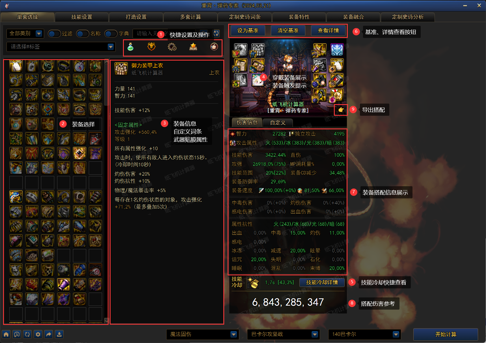

## 软件简介

本软件为 DNF 相关的计算器，供玩家进行搭配装备等各方面使用</br>

!> 请勿使用计算器进行打桩排名、带节奏等行为</br>

为避免营销号节奏及不怀好意的使用方式，现已删除100版本的/CD及宠物技能模拟</br>
本工具为开源免费软件，不存在收费等情况，请自行甄别下载途径和使用方式</br>

!> 由colg赞助，与无名空岛是两个不同的软件，空岛相关咨询和建议联系冰柠檬


## 程序版本说明

计算器分为桌面版、网页版、小程序版

- 网页版：网页程序，访问链接 https://dcalc.dnftools.com ，部署在服务器端，限制了多套计算，存档保存在用户浏览器的localStorage内，更新最为及时，会有较多测试性功能
- 桌面版：桌面端计算程序，需要下载后安装使用，存档保存在用户本地，下载链接 https://wwk.lanzout.com/s/dcalc ，调用本地系统资源，支持大数据量的多套及多窗口同时打开，会在网页版测试稳定后推送程序版本
- 小程序：微信搜索`纸飞机计算器`，不支持调整技能次数等复杂操作，仅为方便部分手机用户使用

## BUG反馈

为了契合DNF双服的版本更新、职业平衡，更新过程中不可避免的会存在部分功能bug以及部分职业的隐藏设定未能考虑到，计算器欢迎<strong>友好</strong>的bug反馈
- [gitee](https://gitee.com/dcalc/dnfcalculating_110/issues)
- [colg](https://bbs.colg.cn/thread-9130678-1-1.html)
- [QQ群](http://qm.qq.com/cgi-bin/qm/qr?_wv=1027&k=Cd6K0WTQgcJEefXYnPt1jm1JZh6uLTEb&authKey=LfdldC2BoibB6CxHXzf%2FYcH43YBWN6WCaDFYoL2XqUCGg%2BC%2B1IIVx%2FcCPdWJCEMe&noverify=0&group_code=183439472)

反馈样例
  ```
  职业：女弹药
  BUG描述：XXX技能在XXXX情况下，出现伤害XXX异常，存档设置：aaaaa-bbbbb-ccccc-ddddd
  ```


## 开始使用

<strong>下载路径</strong>: https://wwk.lanzout.com/s/dcalc<br>

</br>

下载网盘中最新程序`DNF计算器_XX.XX_.exe`并完成安装</br>

- exe：安装包，多次使用会删除老的存档
- 绿色版：免安装版本，解压到文件夹下后，打开`DNF计算器.exe`即可，覆盖不会删除存档
- 更新包：计算器的更新文件，可手动下载后覆盖计算器下的`resources`文件夹

## 合规性校验


正规途径下载的计算器，右键 exe 程序的属性，可在数字签名中查看到第三方机构认证颁发的代码签名

!> 使用前请确保数字签名存在且与说明书中一致<br>如无数字签名，则程序可能为第三方修改后的打包版本，请谨慎使用<br>

## 常见问题

- 蓝奏云无法打开<br> 修改 DNS 服务器地址，首选 114.114.114.114，备用 8.8.8.8<br>
- 打开黑屏 Ctrl R<br>
  仍然无效，可尝试运行安装路径下`resources\修复脚本.bat`
- Permission denied：安装再非C盘或管理员运行
- 程序放大：Ctrl shift +
- 程序缩小：Ctrl -

## 更新

### 自动更新

</br>

</br>

计算器在每次打开的时候会自动检测是否有版本更新，确认后将进行自动更新，更新完毕点击完成会自动重启计算器

### 手动更新

如自动更新报错或想要手动更新，有如下两种方式手动更新，且存档不会丢失：

- 关闭计算器后，手动下载网盘中更新包`resources.zip`，手动解压覆盖如下文件夹<br> </br>
- 关闭计算器后，手动下载网盘中绿色版，直接覆盖


## 单套选择



### 快捷设置及操作
从左向右图标依次为药剂设置、特性系统、装备触发条件、收藏、流派推荐
- 当存在多个装备版本时，药剂设置左侧会出现装备版本快捷切换
- 药剂设置：设置常见消耗的药剂，如斗神、灵药等<br/>
- 特性系统：快捷设置特性系统入口<br/>
- 装备触发条件：设置部分无法完全模拟的装备触发条件，如部分职业的CP武器、敌人异常情况等<br/>
- 收藏：收藏用户自己不同的搭配，方便快捷切换对比<br/>
- 流派推荐：取自colg流派模拟数据，由玩家自行上传<br/>

### 装备设置
在左侧选择装备后，右侧会自行展示装备1级的属性并穿戴计算。<br/>
当用户选择装备为自定义装备时，右侧展示所有自定义词条，并按照选择词条后的提升进行排序供参考，可勾选词条分类切换词条的划分，默认按照伤害、CD、其他划分，取消勾选后按照专属、部位、公共划分。<br/>

当选择装备为武器时，左侧会默认展示贴膜选择，用户可点击信息、融合进行切换选择。

### 装备展示
展示角色穿戴的装备及贴膜情况，当装备属性未完全触发时，装备图标展示为灰色，鼠标移动到图标可显示装备属性及装备未能触发的条件。<br/>


### 技能冷却详情
点击技能冷却详情，会展示当前搭配下技能的冷却情况及适用的CDR供参考。


### 左下角工具栏
从左向右图标依次是首页、检查更新、刷新、设置、存档分享、存档导入<br/>

- 首页：跳转到计算器首页，可查阅更新日志、使用手册等
- 检查更新：检查桌面端计算器是否有更新
- 刷新：重新获取Token及接口信息
- 设置：点击后对计算器部分功能进行自定义设置，详细设置如下，装备版本存在切换时，在快捷设置
  
- 存档分享、存档导入：供用户多终端或用户与用户之间进行存档分享

### 基准、详情查看
- 设为基准：以当前搭配每个技能的伤害、总伤害为基准与其他搭配进行对比，搭配伤害参考与详情界面会变成相较于基准搭配的伤害百分比变化<br/>
  
- 显示伤害：删除基准数值，显示正常数值
- 查看详情：查看每个技能的详细数据
  

### 导出搭配
为了方便用户快捷导出搭配分享，点击👉，可自动根据当前搭配生成搭配图，展示装备信息、自定义信息、武器融合信息等，并导出图片进行分享。<br/>


## 技能设置

</br>该页面下可设置计算技能相关：技能等级、技能次数、技能形态、护石、符文</br>

### 技能队列说明

</br>在选择技能次数后，会自动添加技能到队列中，部分右上角有文字的技能可点击图标进行形态切换，技能图标可长按拖拽进行队列位置变更</br>

!> 为了避免工具滥用，现已删除/CD功能，预设技能次数为colg提供</br>

### 职业特殊设置
部分较为特殊的职业如女机械、召唤，需要在右侧设置续航类技能输出时间

## 打造设置


点击对应的部位，可切换部位进行打造修改</br> 右上角可进行全局修改勾选，可全部部位一起设置增幅、成长属性，同类型可一直设置附魔、徽章</br> 星辰百变、贴膜升级在此处进行勾选，默认已勾选

属性修正为在部分测试情况下，自行调整属性使用，常规可不使用

## 定制史诗词条


所有自定义装备单独设置的地方，单件的设置已在单套选择功能中包含

## 装备特性


装备特性设置，已在单套选择功能中包含

## 装备融合


装备融合设置，已在单套选择功能中包含